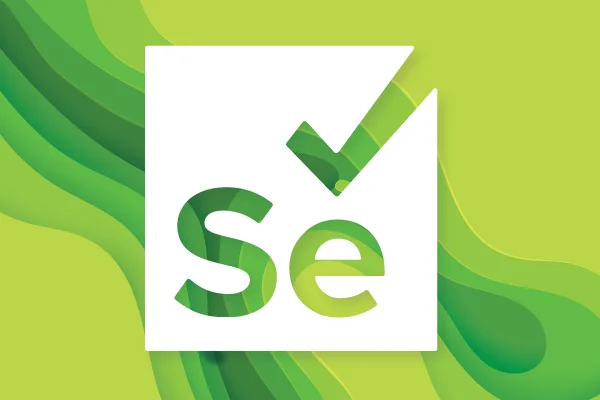
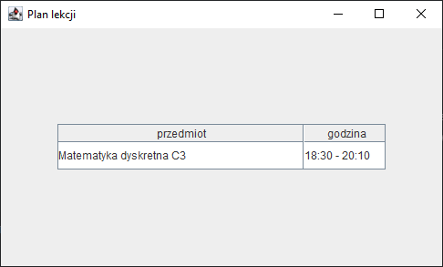

<!-- Improved compatibility of back to top link: See: https://github.com/othneildrew/Best-README-Template/pull/73 -->
<a name="readme-top"></a>
<!--
*** Thanks for checking out the Best-README-Template. If you have a suggestion
*** that would make this better, please fork the repo and create a pull request
*** or simply open an issue with the tag "enhancement".
*** Don't forget to give the project a star!
*** Thanks again! Now go create something AMAZING! :D
-->

<br />
<div align="center">
  <a href="https://www.selenium.dev/">
    
  </a>

  <h3 align="center">seleniumWebScraper</h3>

  <p align="center">
    Small solo web scraping project.
    <br />
    <a href="https://ypanator.github.io/seleniumWebScraper/App.html"><strong>Explore the docs »</strong></a>
    <br />
    <br />
  </p>
</div>

<details>
  <summary>Table of Contents</summary>
  <ol>
    <li>
      <a href="#about-the-project">About The Project</a>
    </li>
    <li>
      <a href="#getting-started">Getting Started</a>
      <ul>
        <li><a href="#prerequisites">Prerequisites</a></li>
        <li><a href="#installation">Installation</a></li>
      </ul>
    </li>
    <li><a href="#usage">Usage</a></li>
    <li><a href="#roadmap">Roadmap</a></li>
    <li><a href="#license">License</a></li>
    <li><a href="#acknowledgments">Acknowledgments</a></li>
  </ol>
</details>

## About The Project

<p>
  My first small web scraping project.

* Fetches school timetable from the website.
* Handles the login and finds the timetable.
* Configurable with a config file.
* Caches the timetable to avoid costly scraping.

Configuration file is in `src\main\resources\config.properties`.</br>
<b>Constructive criticism</b> is always welcome!</br>
Feel free to contribute or help in any way.
</p>

<p align="right">(<a href="#readme-top">back to top</a>)</p>

## Getting Started

### Prerequisites

* Java
* Maven

### Installation

1. Clone the repo.

   ```sh
   git clone https://github.com/ypanator/seleniumWebScraper.git
   ```

2. Install the project.

   ```sh
   mvn clean install
   ```

3. Enter login and password into the `config.properties` file.

   ```
   password=
   login=
   ```

4. Run and test the project.

   ```
   mvn exec:java
   mvn test
   ```

<p align="right">(<a href="#readme-top">back to top</a>)</p>

## Usage

<p align="center"></p>

<p align="right">(<a href="#readme-top">back to top</a>)</p>

## Roadmap

The project is <b>finished</b>.<br>
Any suggestions for improvements or ideas are always welcome.<br>
Feel free to contribute as you like!

<p align="right">(<a href="#readme-top">back to top</a>)</p>

## License

Distributed under the MIT License. See `LICENSE.md` for more information.

<p align="right">(<a href="#readme-top">back to top</a>)</p>

## Acknowledgments

* [Choose an Open Source License](https://choosealicense.com)
* [README-template](https://github.com/othneildrew/Best-README-Template)
* [Maven](https://maven.apache.org/)
* [Selenium](https://www.selenium.dev/)

<p align="right">(<a href="#readme-top">back to top</a>)</p>
